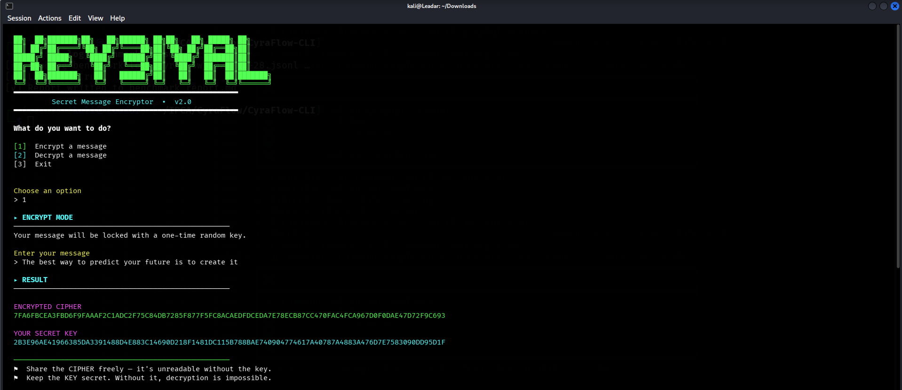

# KEY3IYAL 🔐
 
> A character-level one-time-pad cipher for secret messages 
 

 
---
 
## What is KEY3IYAL?
 
KEY3IYAL is a personal encryption algorithm that locks any text message behind a randomly generated key. Every encryption run produces a **unique cipher** — even for the same message — because the key is different every time. Without the exact key, the cipher is unreadable.
 
The algorithm works like a one-time pad: for each character, a random offset is generated and added to its byte value. The offsets form the key. To decrypt, the offsets are subtracted back out.
 
---
 
## Usage
 
**Requirements:** Python 3.10+, no external dependencies.
 
```bash
python KEY3IYAL.py
```
 
Then follow the on-screen menu:
 
```
[1]  Encrypt a message
[2]  Decrypt a message
[3]  Exit
```
 
---
 
## Encrypt
 
Enter your plaintext message. You'll receive:
 
| Output | Description |
|--------|-------------|
| **CIPHER** | Hex-encoded encrypted message — safe to share |
| **KEY** | Hex-encoded secret key — keep this private |
 
```
CIPHER  →  8170D5EA88D4E57F83E8A2
KEY     →  390B697E19B48E10117C3E
```
 
Share the cipher freely. **Never share the key.**
 
---
 
## Decrypt
 
Paste the cipher and its matching key. The original message is recovered.
 
```
Cipher  →  8170D5EA88D4E57F83E8A2
Key     →  390B697E19B48E10117C3E
Output  →  Hello World
```
 
---
 
## How the algorithm works
 
```
Encrypt:
  for each character c in message:
      offset  =  random integer in [0, 255 - ord(c)]
      cipher  =  chr(ord(c) + offset)   → hex encoded
      key     =  offset                 → hex encoded
 
Decrypt:
  for each byte pair (cipher_byte, key_byte):
      original = cipher_byte - key_byte
      output   = chr(original)
```
 
The cipher bytes land in [ord(c), 255], so no character overflows. Decryption is lossless.
 
---
 
## Security notes
 
- The algorithm is a **per-character one-time pad** — theoretically unbreakable if:
  - The key is truly random ✔ (`random.randint`)
  - The key is used only once ✔ (new key every run)
  - The key is kept secret ← **your responsibility**
- Cipher and key are hex-encoded — clean, copy-pasteable, no encoding issues.
- This is a **personal/educational** project. For production security, use AES-GCM or NaCl.
---
